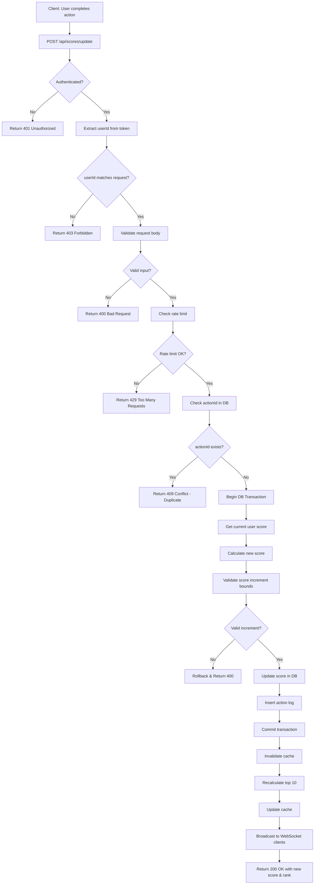
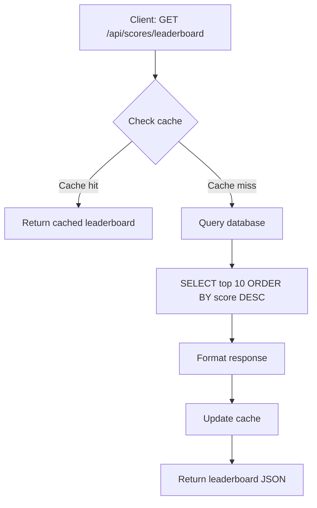
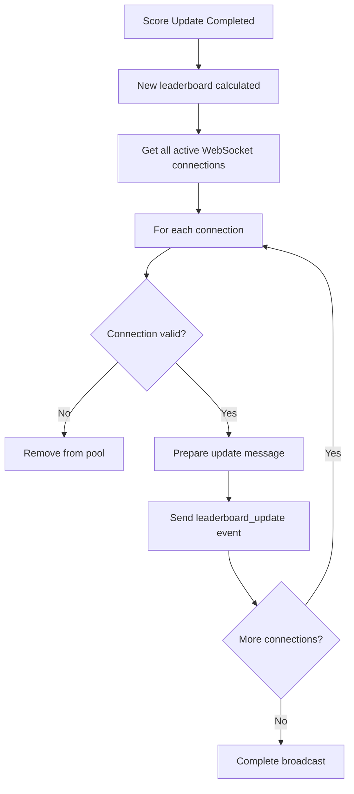
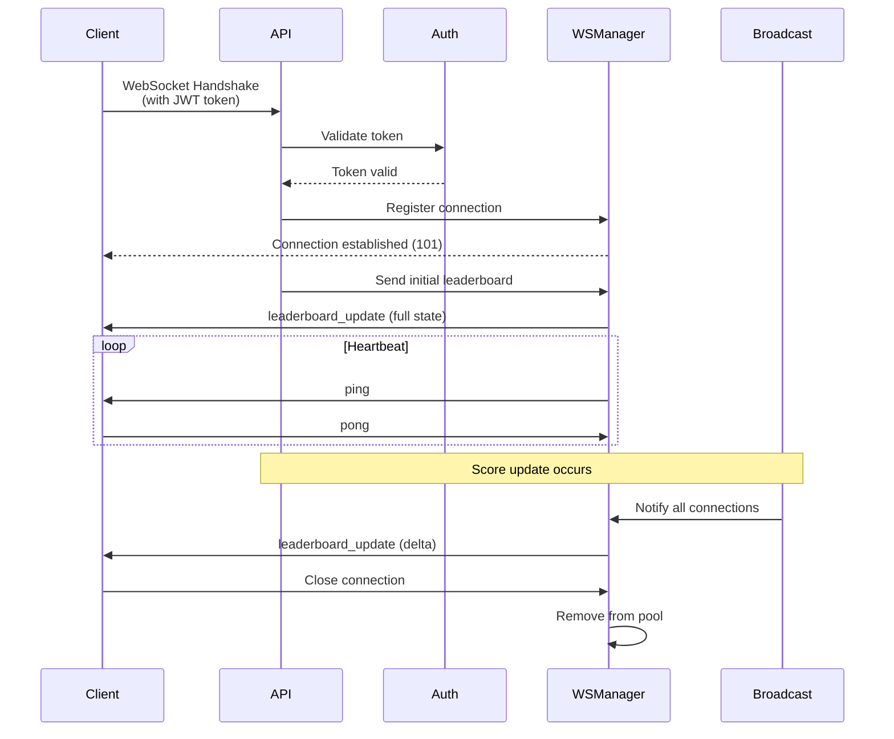
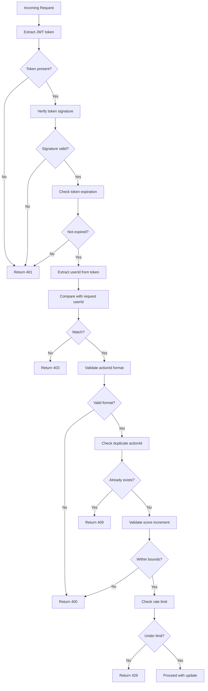
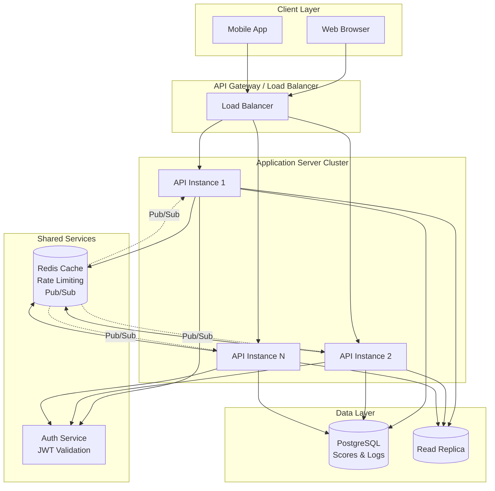
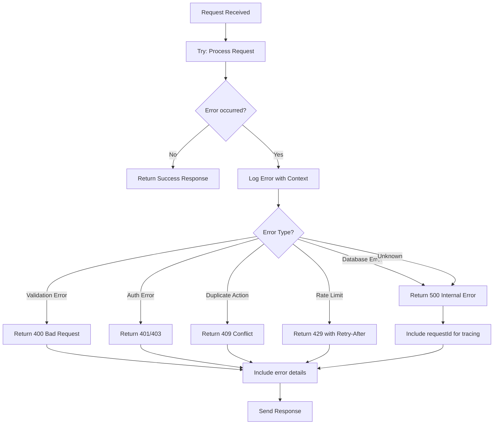
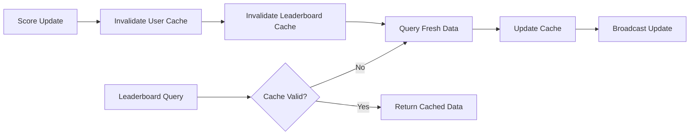

# Scoreboard API Module - Execution Flow Diagrams

## 1. Score Update Flow

## 2. Leaderboard Query Flow

## 3. Real-time Update Broadcast Flow

## 4. WebSocket Connection Lifecycle

## 5. Security Validation Flow

## 6. System Architecture Overview

## 7. Error Handling Flow

## 8. Cache Invalidation Strategy

---

**Note**: These diagrams use Mermaid syntax and can be rendered in:
- GitHub/GitLab markdown viewers
- VS Code with Mermaid extension
- Online Mermaid editors (mermaid.live)
- Documentation tools that support Mermaid

