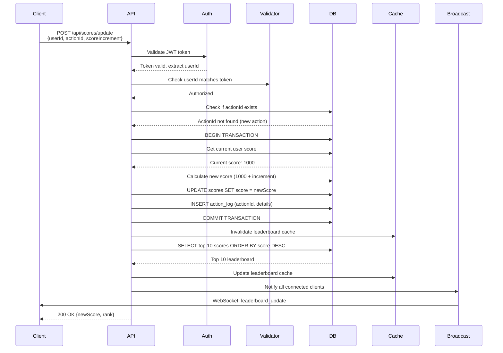

# Scoreboard API Module Specification

> **Note**: For detailed execution flow diagrams, see [`FLOW_DIAGRAM.md`](./FLOW_DIAGRAM.md)

## Overview

This module provides a secure, real-time scoreboard API service that manages user scores and maintains a live-updating top 10 leaderboard. The system handles score updates, validates user actions, and broadcasts changes to connected clients.

## Requirements Summary

1. **Scoreboard Display**: Maintain and serve the top 10 user scores
2. **Live Updates**: Real-time synchronization of scoreboard changes to all connected clients
3. **Score Updates**: API endpoint to increment user scores upon action completion
4. **Security**: Prevent unauthorized score manipulation by malicious users

## Architecture

### System Components

```
┌─────────────┐
│   Client    │ (Website with Scoreboard UI)
└──────┬──────┘
       │ HTTP/WebSocket
       │
┌──────▼──────────────────────────────────────┐
│         API Server (This Module)            │
│  ┌────────────────────────────────────────┐ │
│  │  Authentication & Authorization Layer  │ │
│  └────────────────────────────────────────┘ │
│  ┌────────────────────────────────────────┐ │
│  │      Score Update Handler               │ │
│  │  - Validate action completion           │ │
│  │  - Verify user authorization            │ │
│  │  - Update score in database             │ │
│  └────────────────────────────────────────┘ │
│  ┌────────────────────────────────────────┐ │
│  │      Leaderboard Service               │ │
│  │  - Maintain top 10 cache               │ │
│  │  - Calculate rankings                  │ │
│  └────────────────────────────────────────┘ │
│  ┌────────────────────────────────────────┐ │
│  │      Real-time Broadcast Service       │ │
│  │  - WebSocket/SSE connections           │ │
│  │  - Push updates to clients              │ │
│  └────────────────────────────────────────┘ │
└──────┬──────────────────────────────────────┘
       │
┌──────▼──────┐
│  Database   │ (Persistent storage)
└─────────────┘
```

## API Endpoints

### 1. Update Score

**Endpoint**: `POST /api/scores/update`

**Authentication**: Required (Bearer token or session-based)

**Request Body**:
```json
{
  "userId": "string (UUID or integer)",
  "actionId": "string (unique action identifier)",
  "actionTimestamp": "ISO 8601 datetime",
  "scoreIncrement": "integer (positive, validated)"
}
```

**Response** (200 OK):
```json
{
  "success": true,
  "newScore": 1250,
  "rank": 7,
  "message": "Score updated successfully"
}
```

**Error Responses**:
- `400 Bad Request`: Invalid request body or validation failure
- `401 Unauthorized`: Missing or invalid authentication token
- `403 Forbidden`: User not authorized for this action
- `409 Conflict`: Duplicate actionId (prevent replay attacks)
- `429 Too Many Requests`: Rate limit exceeded
- `500 Internal Server Error`: Server error

### 2. Get Top 10 Leaderboard

**Endpoint**: `GET /api/scores/leaderboard`

**Authentication**: Optional (public read, authenticated for additional metadata)

**Query Parameters**:
- `limit` (optional): Number of entries (default: 10, max: 100)
- `offset` (optional): Pagination offset (default: 0)

**Response** (200 OK):
```json
{
  "leaderboard": [
    {
      "userId": "uuid-1",
      "username": "player1",
      "score": 5000,
      "rank": 1,
      "lastUpdated": "2024-01-15T10:30:00Z"
    },
    {
      "userId": "uuid-2",
      "username": "player2",
      "score": 4500,
      "rank": 2,
      "lastUpdated": "2024-01-15T10:25:00Z"
    }
    // ... up to 10 entries
  ],
  "generatedAt": "2024-01-15T10:35:00Z"
}
```

### 3. Get User Score

**Endpoint**: `GET /api/scores/user/:userId`

**Authentication**: Required (users can only view their own score, admins can view any)

**Response** (200 OK):
```json
{
  "userId": "uuid-1",
  "username": "player1",
  "score": 1250,
  "rank": 7,
  "lastUpdated": "2024-01-15T10:30:00Z"
}
```

**Error Responses**:
- `401 Unauthorized`: Missing authentication
- `403 Forbidden`: Not authorized to view this user's score
- `404 Not Found`: User not found

### 4. WebSocket Connection (Live Updates)

**Endpoint**: `WS /api/scores/live` or `SSE /api/scores/stream`

**Authentication**: Required (Bearer token in connection handshake)

**Connection Flow**:
1. Client establishes WebSocket/SSE connection with auth token
2. Server validates token and subscribes client to scoreboard updates
3. Server sends initial top 10 leaderboard state
4. Server pushes updates whenever leaderboard changes

**Message Format** (Server → Client):
```json
{
  "type": "leaderboard_update",
  "timestamp": "2024-01-15T10:35:00Z",
  "changes": [
    {
      "userId": "uuid-1",
      "newRank": 5,
      "oldRank": 7,
      "newScore": 1300
    }
  ],
  "leaderboard": [
    // Full top 10 array (or delta if client supports it)
  ]
}
```

## Database Schema

### Scores Table
```sql
CREATE TABLE scores (
  id BIGSERIAL PRIMARY KEY,
  user_id VARCHAR(255) NOT NULL,
  score INTEGER NOT NULL DEFAULT 0,
  last_updated TIMESTAMP NOT NULL DEFAULT CURRENT_TIMESTAMP,
  created_at TIMESTAMP NOT NULL DEFAULT CURRENT_TIMESTAMP,
  INDEX idx_user_id (user_id),
  INDEX idx_score_desc (score DESC),
  UNIQUE KEY unique_user (user_id)
);
```

### Action Logs Table (Audit Trail)
```sql
CREATE TABLE score_action_logs (
  id BIGSERIAL PRIMARY KEY,
  user_id VARCHAR(255) NOT NULL,
  action_id VARCHAR(255) NOT NULL UNIQUE,
  score_increment INTEGER NOT NULL,
  previous_score INTEGER NOT NULL,
  new_score INTEGER NOT NULL,
  action_timestamp TIMESTAMP NOT NULL,
  server_timestamp TIMESTAMP NOT NULL DEFAULT CURRENT_TIMESTAMP,
  ip_address VARCHAR(45),
  user_agent TEXT,
  INDEX idx_user_id (user_id),
  INDEX idx_action_id (action_id),
  INDEX idx_timestamp (server_timestamp)
);
```

## Security Measures

### 1. Authentication & Authorization
- **JWT Tokens**: All score update requests must include a valid JWT token
- **Token Validation**: Verify token signature, expiration, and user permissions
- **User Context**: Extract `userId` from token (never trust client-provided userId in body)
- **Action Verification**: Validate that the authenticated user matches the request's userId

### 2. Replay Attack Prevention
- **Unique Action IDs**: Each action must have a globally unique `actionId`
- **Idempotency Check**: Store `actionId` in database and reject duplicates
- **Timestamp Validation**: Verify `actionTimestamp` is recent (within last 5 minutes)
- **Nonce System**: Consider adding a nonce to prevent request replay

### 3. Rate Limiting
- **Per-User Limits**: Maximum N score updates per minute per user (e.g., 60/minute)
- **Per-IP Limits**: Additional rate limiting by IP address
- **Sliding Window**: Use Redis or similar for distributed rate limiting
- **Graceful Degradation**: Return 429 with `Retry-After` header

### 4. Input Validation
- **Score Increment Bounds**: Validate `scoreIncrement` is positive and within reasonable range (e.g., 1-1000)
- **Type Checking**: Strict validation of all input types
- **Sanitization**: Sanitize all string inputs to prevent injection attacks
- **Schema Validation**: Use JSON schema validation library (e.g., Zod, Joi)

### 5. Score Manipulation Prevention
- **Server-Side Calculation**: Always calculate new score on server, never trust client calculation
- **Atomic Updates**: Use database transactions to ensure atomic score updates
- **Audit Logging**: Log all score changes with full context for forensic analysis
- **Anomaly Detection**: Monitor for unusual patterns (rapid score increases, suspicious timing)

### 6. Data Integrity
- **Database Constraints**: Foreign keys, check constraints, unique constraints
- **Transaction Isolation**: Use appropriate isolation levels to prevent race conditions
- **Optimistic Locking**: Consider version numbers or timestamps to prevent concurrent update conflicts

## Implementation Flow



## Performance Considerations

### 1. Caching Strategy
- **Leaderboard Cache**: Cache top 10 leaderboard in Redis (TTL: 1-5 seconds)
- **User Score Cache**: Cache individual user scores (TTL: 30 seconds)
- **Cache Invalidation**: Invalidate on every score update
- **Cache Warming**: Pre-populate cache on server startup

### 2. Database Optimization
- **Indexes**: 
  - Composite index on `(score DESC, user_id)` for leaderboard queries
  - Index on `user_id` for user lookups
  - Index on `action_id` for duplicate detection
- **Query Optimization**: Use `LIMIT` and efficient ordering
- **Connection Pooling**: Maintain database connection pool
- **Read Replicas**: Consider read replicas for leaderboard queries

### 3. Real-time Updates
- **WebSocket Pool**: Maintain connection pool with heartbeat
- **Message Batching**: Batch multiple updates into single broadcast if rapid
- **Compression**: Compress WebSocket messages for large payloads
- **Fallback**: Provide SSE (Server-Sent Events) as fallback for WebSocket

### 4. Scalability
- **Horizontal Scaling**: Stateless API design allows multiple instances
- **Shared State**: Use Redis for shared cache and rate limiting
- **Load Balancing**: Distribute WebSocket connections across instances
- **Database Sharding**: Consider sharding by user_id if scale requires

## Error Handling

### Error Response Format
```json
{
  "error": {
    "code": "ERROR_CODE",
    "message": "Human-readable error message",
    "details": {
      "field": "actionId",
      "reason": "Duplicate actionId detected"
    },
    "timestamp": "2024-01-15T10:35:00Z",
    "requestId": "uuid-for-tracing"
  }
}
```

### Error Codes
- `AUTH_REQUIRED`: Authentication token missing
- `AUTH_INVALID`: Invalid or expired token
- `AUTH_FORBIDDEN`: User not authorized for this action
- `VALIDATION_ERROR`: Request validation failed
- `DUPLICATE_ACTION`: ActionId already processed
- `RATE_LIMIT_EXCEEDED`: Too many requests
- `SCORE_BOUNDS_ERROR`: Score increment out of valid range
- `DATABASE_ERROR`: Database operation failed
- `INTERNAL_ERROR`: Unexpected server error

## Testing Requirements

### Unit Tests
- Score calculation logic
- Validation functions
- Cache operations
- Rate limiting logic

### Integration Tests
- API endpoint responses
- Database transactions
- Authentication flow
- WebSocket connection handling

### Load Tests
- Concurrent score updates
- Leaderboard query performance
- WebSocket broadcast performance
- Rate limiting under load

### Security Tests
- Authentication bypass attempts
- SQL injection attempts
- Replay attack simulation
- Rate limit bypass attempts

## Monitoring & Observability

### Metrics to Track
- Score update request rate
- Average response time
- Error rates by type
- Leaderboard query performance
- WebSocket connection count
- Cache hit/miss rates
- Database query performance

### Logging
- All score updates (with actionId, userId, increment)
- Authentication failures
- Rate limit violations
- Database errors
- WebSocket connection events

### Alerts
- High error rate (>5% of requests)
- Unusual score increment patterns
- Database connection pool exhaustion
- Cache service unavailability

## Deployment Considerations

### Environment Variables
```bash
DATABASE_URL=postgresql://...
REDIS_URL=redis://...
JWT_SECRET=...
JWT_EXPIRY=3600
RATE_LIMIT_PER_MINUTE=60
MAX_SCORE_INCREMENT=1000
CACHE_TTL_SECONDS=5
WEBSOCKET_HEARTBEAT_INTERVAL=30
```

### Health Checks
- `GET /health`: Basic health check
- `GET /health/db`: Database connectivity check
- `GET /health/cache`: Cache service check
- `GET /health/ws`: WebSocket service status

## Future Improvements & Recommendations

### 1. Enhanced Security
- **Two-Factor Authentication**: Require 2FA for high-value score updates
- **IP Whitelisting**: Optional IP-based access control
- **Behavioral Analysis**: ML-based anomaly detection for suspicious patterns
- **Honeypot Endpoints**: Decoy endpoints to detect automated attacks

### 2. Performance Enhancements
- **GraphQL API**: Consider GraphQL for flexible leaderboard queries
- **CDN Integration**: Cache leaderboard responses at edge
- **Database Partitioning**: Partition scores table by date or user range
- **Materialized Views**: Pre-compute leaderboard rankings

### 3. Feature Extensions
- **Historical Leaderboards**: Daily/weekly/monthly leaderboards
- **Score Categories**: Different score types (e.g., daily challenges, achievements)
- **User Profiles**: Extended user information in leaderboard
- **Notifications**: Push notifications for rank changes

### 4. Reliability
- **Circuit Breakers**: Prevent cascade failures
- **Retry Logic**: Automatic retry with exponential backoff
- **Dead Letter Queue**: Queue failed updates for manual review
- **Backup Strategy**: Regular database backups with point-in-time recovery

### 5. Developer Experience
- **API Versioning**: Version endpoints (e.g., `/api/v1/scores`)
- **OpenAPI/Swagger**: Auto-generated API documentation
- **SDK/Client Libraries**: Provide client libraries for common languages
- **Webhook Support**: Allow clients to register webhooks for score updates

### 6. Analytics
- **Score Distribution Analysis**: Track score distribution over time
- **User Engagement Metrics**: Active users, update frequency
- **Leaderboard Churn**: Track how often top 10 changes
- **Performance Dashboards**: Real-time system health dashboards

## Implementation Checklist

- [ ] Database schema creation and migrations
- [ ] Authentication middleware implementation
- [ ] Score update endpoint with validation
- [ ] Leaderboard query endpoint
- [ ] User score lookup endpoint
- [ ] WebSocket/SSE real-time update service
- [ ] Rate limiting middleware
- [ ] Action ID duplicate detection
- [ ] Audit logging system
- [ ] Caching layer (Redis)
- [ ] Error handling and response formatting
- [ ] Input validation and sanitization
- [ ] Unit tests
- [ ] Integration tests
- [ ] Load testing
- [ ] Security testing
- [ ] Monitoring and logging setup
- [ ] API documentation (OpenAPI/Swagger)
- [ ] Deployment configuration
- [ ] Health check endpoints

## Notes for Implementation Team

1. **Start Simple**: Begin with basic CRUD operations, then add real-time features
2. **Security First**: Implement authentication and validation before other features
3. **Test Early**: Write tests alongside implementation, not after
4. **Monitor Everything**: Set up logging and metrics from day one
5. **Document Decisions**: Keep architecture decision records (ADRs)
6. **Code Review Focus**: Pay special attention to security and performance in reviews

---

**Document Version**: 1.0  
**Last Updated**: 2024-01-15  
**Author**: Backend Architecture Team

